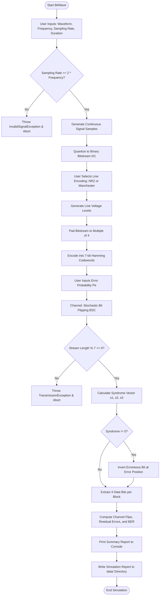
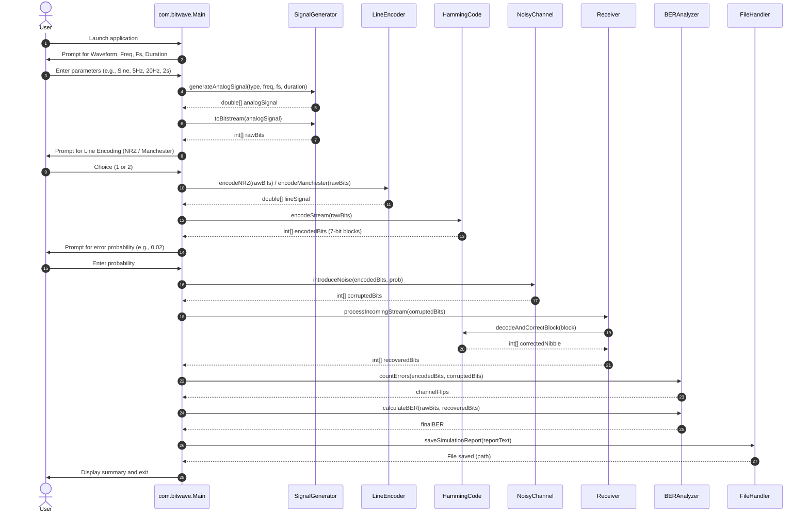
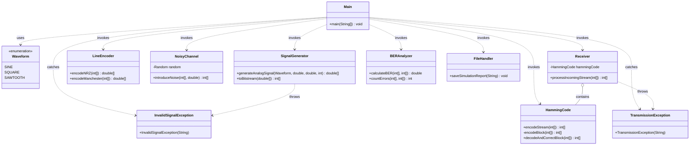

# BitWave: Digital Communication Simulator with Forward Error Correction
## Comprehensive Project Report

**Course Evaluation**: Flipped Course Project / Build Your Own Project  
**Course Domain**: Digital Communications & Object-Oriented Software Engineering  
**Student Name**: Yuvraj Singh  
**Registration Number**: 25BSA10055  
**Institution**: Vellore Institute of Technology (VIT)  
**Academic Year**: 2025–2026  

---

# Table of Contents
1. [Cover Page](#1-cover-page)
2. [Introduction](#2-introduction)
3. [Problem Statement](#3-problem-statement)
4. [Functional Requirements](#4-functional-requirements)
5. [Non-Functional Requirements](#5-non-functional-requirements)
6. [System Architecture](#6-system-architecture)
7. [Design Diagrams](#7-design-diagrams)
   - 7.1 [Use Case Diagram](#71-use-case-diagram)
   - 7.2 [Workflow / Process Flow Diagram](#72-workflow--process-flow-diagram)
   - 7.3 [Sequence Diagram](#73-sequence-diagram)
   - 7.4 [Class & Component Diagram](#74-class--component-diagram)
   - 7.5 [Storage & Log Schema Design](#75-storage--log-schema-design)
8. [Design Decisions & Rationale](#8-design-decisions--rationale)
9. [Implementation Details](#9-implementation-details)
10. [Screenshots & Simulation Results](#10-screenshots--simulation-results)
11. [Testing Approach & Test Matrix](#11-testing-approach--test-matrix)
12. [Challenges Faced & Solutions](#12-challenges-faced--solutions)
13. [Learnings & Key Takeaways](#13-learnings--key-takeaways)
14. [Future Enhancements](#14-future-enhancements)
15. [References](#15-references)
16. [Evaluation Rubric Self-Assessment](#16-evaluation-rubric-self-assessment)

---

# 1. Cover Page

```
========================================================================================
                               VELLORE INSTITUTE OF TECHNOLOGY
                           Build Your Own Project (BYOP) Evaluation
========================================================================================

PROJECT TITLE:
BitWave: Digital Communication Simulator with Forward Error Correction and Noise Analysis

STUDENT DETAILS:
Name:                 Yuvraj Singh
Registration No.:     25BSA10055
Course / Discipline:  Object-Oriented Software Engineering / Digital Communication Systems
Submission Date:      September 2026

PROJECT OBJECTIVE:
To simulate and evaluate the transmission of digital data over a noisy channel, implementing
Nyquist-compliant signal sampling, bipolar line encoding, systematic (7,4) Hamming Forward
Error Correction (FEC), and Bit Error Rate (BER) analytics.

REPOSITORY NAME:
BitWave (Java Console Application)
========================================================================================
```

---

# 2. Introduction

Digital communication forms the backbone of modern technological infrastructure, enabling data exchange across the Internet, cellular networks, satellite uplinks, and deep-space telemetry. In any physical communication link, continuous real-world phenomena (such as audio, sensor telemetry, and analog waveforms) must be converted into discrete electrical signals and transmitted across physical media.

However, real physical channels—whether copper wire, fiber optics, or radio frequency wireless links—are inherently imperfect. Physical channels suffer from:
- **Thermal Noise**: Random electron motion causing stochastic additive white Gaussian noise.
- **Inter-Symbol Interference (ISI)**: Pulse spreading causing adjacent symbols to overlap.
- **Signal Attenuation**: Loss of power as signals traverse physical distances.

When digital signals travel through noisy media, voltage fluctuations can cause logic levels to flip (a transmitted binary `1` may be interpreted as a binary `0`, or vice-versa). Without protective engineering techniques, these transmission errors compromise data integrity.

To combat channel degradation, communications engineers employ two key techniques:
1. **Signal Conditioning and Line Encoding**: Structuring binary pulses into balanced waveforms (such as Non-Return-to-Zero and Manchester encoding) to ensure DC balance and timing synchronization.
2. **Channel Coding / Forward Error Correction (FEC)**: Introducing controlled mathematical redundancy into the transmitted bitstream so the receiver can autonomously detect and correct bit flips without requiring retransmission.

**BitWave** is a standalone, modular software simulator built in Java. It models the entire physical layer pipeline—from analog waveform synthesis and Nyquist-Shannon sampling to line encoding, Hamming error correction, stochastic channel degradation, syndrome decoding, and statistical Bit Error Rate analysis.

---

# 3. Problem Statement

In traditional hardware communication laboratories, studying digital signal transmission requires dedicated signal generators, oscilloscopes, noise generators, and FPGA/DSP test benches. These setups present several challenges:
- High cost and limited physical availability in university labs.
- Difficulty in isolating and parameterizing specific channel phenomena (e.g., dialling in an exact 2% bit-flip probability).
- Lack of real-time visibility into internal intermediate states (e.g., parity bit generation, syndrome vectors, and bit-level correction matrices).

Furthermore, students often study theoretical mathematical theorems (such as the Nyquist-Shannon sampling theorem, Hamming distance bounds, and generator polynomials) in isolation from practical software engineering principles (such as modular architecture, exception handling, and object-oriented encapsulation).

**Objective**:  
To design and implement **BitWave**, a software-based digital communication simulator that:
1. Synthesizes standard continuous periodic waveforms (Sine, Square, Sawtooth).
2. Mathematically validates sampling rates against the Nyquist-Shannon criterion ($F_s \ge 2 \cdot F_{max}$) and handles violations gracefully.
3. Converts sampled analog amplitudes into discrete binary bitstreams.
4. Provides line encoding representations (NRZ and Manchester).
5. Implements systematic (7,4) Hamming Forward Error Correction to protect data blocks.
6. Simulates a Binary Symmetric Channel (BSC) with user-controlled error probabilities.
7. Executes receiver-side syndrome decoding to detect and correct single-bit transmission errors.
8. Computes and logs performance metrics, including raw channel bit flips and residual Bit Error Rates (BER).

---

# 4. Functional Requirements

The BitWave simulator consists of four interconnected functional modules providing a clear input/output workflow:

### Module 1: Signal Generation & Sampling
- **FR 1.1**: The system shall generate three types of continuous periodic waveforms: Sine, Square, and Sawtooth.
- **FR 1.2**: The user shall specify the signal frequency ($F > 0\text{ Hz}$), sampling rate ($F_s > 0\text{ Hz}$), and signal duration ($T > 0\text{ s}$).
- **FR 1.3**: The system shall validate the Nyquist-Shannon theorem ($F_s \ge 2 \cdot F$). If $F_s < 2F$, the system shall raise a custom `InvalidSignalException` and safely halt transmission.
- **FR 1.4**: The system shall sample the continuous waveform at uniform intervals ($t_i = i / F_s$) and quantize the samples into a binary bitstream using a zero-crossing threshold ($\text{bit} = 1$ if amplitude $\ge 0$, else $0$).

### Module 2: Line & Channel Encoding
- **FR 2.1**: The system shall provide line encoding options:
  - **NRZ (Non-Return-to-Zero)**: Maps binary `1` to $+1.0\text{V}$ and binary `0` to $-1.0\text{V}$.
  - **Manchester**: Maps binary `1` to a high-to-low transition $(+1.0\text{V}, -1.0\text{V})$ and binary `0` to a low-to-high transition $(-1.0\text{V}, +1.0\text{V})$.
- **FR 2.2**: The system shall implement systematic (7,4) Hamming code. The raw bitstream shall be partitioned into 4-bit data nibbles (zero-padded if total bits is not a multiple of 4).
- **FR 2.3**: For each 4-bit nibble, the system shall compute three parity bits ($p_1, p_2, p_3$) and construct a 7-bit codeword block.

### Module 3: Noisy Channel Simulation
- **FR 3.1**: The user shall specify a channel error probability $P_e \in [0.0, 1.0]$.
- **FR 3.2**: The system shall simulate a Binary Symmetric Channel (BSC) by executing a Bernoulli trial for each transmitted bit: flipping the bit if a pseudo-random value $r < P_e$.
- **FR 3.3**: The channel module shall return the corrupted encoded bitstream without altering the original bitstream buffer.

### Module 4: Receiver, Error Correction & Analytics
- **FR 4.1**: The receiver shall validate that the incoming stream length is a multiple of 7 bits; otherwise, it throws a `TransmissionException`.
- **FR 4.2**: The receiver shall compute the 3-bit syndrome vector ($s_1, s_2, s_3$) for each 7-bit received codeword.
- **FR 4.3**: If the syndrome vector is non-zero, the receiver shall identify the exact erroneous bit position ($1 \le E \le 7$) and invert that bit to restore the original codeword.
- **FR 4.4**: The receiver shall extract the 4 corrected data bits from each block to reconstruct the final received bitstream.
- **FR 4.5**: The system shall compute:
  - Total bits flipped by channel noise.
  - Residual uncorrected bit errors after Hamming decoding.
  - Final Bit Error Rate: $\text{BER} = \frac{\text{Residual Errors}}{\text{Original Bit Length}}$.
- **FR 4.6**: The system shall format an execution summary and automatically write a timestamped report to `data/Simulation_Report_YYYYMMDD_HHMMSS.txt`.

---

# 5. Non-Functional Requirements

To ensure software quality, reliability, and academic rigor, BitWave satisfies six non-functional requirements:

| Requirement | Metric / Criterion | Implementation Strategy |
|---|---|---|
| **NFR 1: Performance** | Execution latency $< 100\text{ ms}$ for standard inputs ($N \le 10,000$ bits). | $O(N)$ linear time algorithms for sampling, bit flipping, and block-by-block syndrome decoding. Primitive integer arrays used throughout to minimize garbage collection overhead. |
| **NFR 2: Usability** | Command-line prompts with input boundaries and immediate feedback. | Clear sequential menus (Steps 1 to 4) displaying expected input ranges, Nyquist threshold hints ($F_s \ge 2 \cdot F$), and plain English summary tables. |
| **NFR 3: Reliability & Robustness** | Zero unhandled crashes during user entry or runtime processing. | All input exceptions (out-of-bounds waveforms, negative frequencies, illegal probabilities) and transmission errors are trapped by custom checked exceptions (`InvalidSignalException`, `TransmissionException`). |
| **NFR 4: Maintainability & Modularity** | Clean separation of concerns with 11 cohesive classes across 7 subpackages. | Decoupled components (`signal`, `channel`, `encoding`, `receiver`, `analysis`, `exceptions`, `util`). Any module can be modified independently without breaking others. |
| **NFR 5: Error Handling Strategy** | Custom checked exceptions rather than generic `RuntimeException`. | Domain-specific exception hierarchy separating signal-domain errors (`InvalidSignalException`) from channel framing errors (`TransmissionException`). |
| **NFR 6: Resource Efficiency & Portability** | Zero third-party dependencies; runs on any standard JVM (Java 8+). | Implemented using standard Java SE libraries (`java.util`, `java.io`, `java.time`). File I/O utilizes relative paths (`data/`) to guarantee cross-platform execution on Windows, Linux, and macOS. |

---

# 6. System Architecture

BitWave follows a **Layered Pipeline Architecture** mimicking the Open Systems Interconnection (OSI) Physical Layer model:

```
+-----------------------------------------------------------------------------+
|                               USER INTERFACE                                |
|             Main.java (Interactive CLI Menu & Execution Pipeline)           |
+-----------------------------------------------------------------------------+
                                       |
                                       v
+-----------------------------------------------------------------------------+
|                                SIGNAL LAYER                                 |
|         Waveform.java (Enum)  |  SignalGenerator.java (Analog Synthesis)    |
|               - Nyquist Validation & Quantized Bitstream Generation         |
+-----------------------------------------------------------------------------+
                                       |
                                       v
+-----------------------------------------------------------------------------+
|                               ENCODING LAYER                                |
|     LineEncoder.java (NRZ / Manchester) | HammingCode.java (7,4 FEC Encode) |
+-----------------------------------------------------------------------------+
                                       |
                                       v
+-----------------------------------------------------------------------------+
|                               CHANNEL LAYER                                 |
|       NoisyChannel.java (Binary Symmetric Channel / Bernoulli Bit Flips)    |
+-----------------------------------------------------------------------------+
                                       |
                                       v
+-----------------------------------------------------------------------------+
|                               RECEIVER LAYER                                |
|        Receiver.java (Block De-framing & Syndrome Error Correction)         |
+-----------------------------------------------------------------------------+
                                       |
                                       v
+-----------------------------------------------------------------------------+
|                             ANALYTICS & I/O                                 |
|     BERAnalyzer.java (Error Counting & BER) | FileHandler.java (Log Files)   |
+-----------------------------------------------------------------------------+
```

### Architectural Characteristics:
1. **Unidirectional Data Flow**: Data flows systematically forward from the Signal Generator through the Encoder, Channel, Receiver, and Analytics Engine.
2. **Encapsulation**: No component directly modifies the internal state of another. Codewords and bitstreams are passed as discrete primitive arrays.
3. **Domain Exception Layer**: Independent exception package (`com.bitwave.exceptions`) prevents cascading failures and provides descriptive feedback.

---

# 7. Design Diagrams

## 7.1 Use Case Diagram

```mermaid
graph LR
    User((Student / User))
    
    subcase1[Select Waveform & Frequencies]
    subcase2[Verify Nyquist-Shannon Rate]
    subcase3[Select Line Encoding Scheme]
    subcase4[Configure Channel Error Probability]
    subcase5[Transmit Through Noisy Channel]
    subcase6[Perform Hamming Error Correction]
    subcase7[Analyze BER & View Report]
    subcase8[Save Timestamped File Report]

    User --> subcase1
    subcase1 --> subcase2
    subcase2 --> subcase3
    subcase3 --> subcase4
    subcase4 --> subcase5
    subcase5 --> subcase6
    subcase6 --> subcase7
    subcase7 --> subcase8
```



## 7.2 Workflow / Process Flow Diagram



## 7.3 Sequence Diagram



## 7.4 Class & Component Diagram



## 7.5 Storage & Log Schema Design

BitWave generates structured, timestamped text files stored within the local `data/` directory.

### Storage Directory Layout:
```text
BitWave/
└── data/
    ├── Simulation_Report_20260914_175553.txt
    ├── Simulation_Report_20260918_120402.txt
    └── Simulation_Report_<TIMESTAMP>.txt
```

### Schema / Record Format:
```text
FIELD NAME                     DATA TYPE        DESCRIPTION
----------------------------------------------------------------------------------------
Header Banner                  String           Static ASCII divider and report header
Waveform Type                  Enum String      Selected waveform (SINE, SQUARE, SAWTOOTH)
Signal Frequency               Float (Hz)       Fundamental frequency of the wave
Sampling Rate                  Float (Hz)       Rate at which analog signal was sampled
Duration                       Integer (s)      Total simulated signal duration in seconds
Raw Bitstream Size             Integer (bits)   Total digital bits after thresholding
Line Encoding                  String           Scheme used (NRZ or Manchester)
Hamming Encoded Stream         Integer (bits)   Total bits transmitted over channel (7/4 ratio)
Channel Error Rate             Percentage       Configured probability of channel bit flip
Channel Bit Flips              Integer (bits)   Total bit corruptions injected by channel
Residual Errors After Decoding Integer (bits)   Errors remaining after receiver decoding
Final Bit Error Rate (BER)     Float (0.0-1.0)  Ratio of residual errors to original data bits
Correction Status              String           SUCCESS (BER = 0.0) or PARTIAL (multibit errors)
```

---

# 8. Design Decisions & Rationale

### 1. Choice of Forward Error Correction: (7,4) Hamming Code
- **Rationale**: While a simple parity check bit only detects odd numbers of bit errors and repetition codes carry excessive overhead (rate $1/3$ or lower), the (7,4) Hamming code has a code rate of $R = 4/7 \approx 0.571$ with a minimum Hamming distance $d_{min} = 3$. According to coding theory:
  $$t = \left\lfloor \frac{d_{min} - 1}{2} \right\rfloor = \left\lfloor \frac{3 - 1}{2} \right\rfloor = 1$$
  This mathematically guarantees that **any single-bit error** occurring anywhere within a 7-bit block can be identified and corrected automatically without retransmission.

### 2. Channel Model: Binary Symmetric Channel (BSC)
- **Rationale**: An analog channel model (like Additive White Gaussian Noise - AWGN) requires complex floating-point modulation/demodulation and matched filtering. For a software simulator focused on digital logic and coding theory, the memoryless Binary Symmetric Channel (BSC) is the standard model. It allows users to control the crossover error probability $p$ directly and observe stochastic behavior.

### 3. Inclusion of Bipolar Line Encoding (NRZ & Manchester)
- **Rationale**: In real communications, binary bitstreams cannot be placed directly on a transmission line as pure logic states. NRZ ensures a clean bipolar voltage representation ($\pm 1\text{V}$), while Manchester guarantees a level transition at the center of every bit period, which is essential for clock recovery and eliminating DC bias.

### 4. Custom Checked Exception Hierarchy
- **Rationale**: Rather than using generic exceptions (e.g. `IllegalArgumentException` or `RuntimeException`), BitWave defines `InvalidSignalException` for signal parameter violations (such as Nyquist rate violations) and `TransmissionException` for frame structure corruptions. This establishes clean separation of domain boundaries and forces the caller to explicitly handle domain failures.

### 5. Zero External Dependencies & Portable Relative File Paths
- **Rationale**: Requiring third-party libraries (such as Apache Commons Math or JavaFX) introduces build complexity and version incompatibilities. Writing BitWave using standard Java SE ensures that any evaluator can compile and run the project immediately with standard `javac` and `java`. Hardcoded absolute file paths were replaced with relative directory resolution (`new File("data")`), ensuring portability across operating systems.

---

# 9. Implementation Details

### 9.1 Mathematical Formulations

#### 1. Continuous Waveform Synthesis:
For a signal of frequency $f$, duration $T$, and sampling rate $F_s$, discrete time steps are computed as $t_i = i / F_s$ for $i = 0, 1, \dots, (F_s \cdot T - 1)$.
- **Sine Wave**:
  $$x(t_i) = \sin(2\pi f t_i)$$
- **Square Wave**:
  $$x(t_i) = \begin{cases} +1.0 & \text{if } \sin(2\pi f t_i) \ge 0 \\ -1.0 & \text{otherwise} \end{cases}$$
- **Sawtooth Wave**:
  $$x(t_i) = 2 \cdot \left(f t_i - \lfloor 0.5 + f t_i \rfloor\right)$$

#### 2. Nyquist-Shannon Sampling Criterion:
A continuous band-limited signal with maximum frequency component $f_{max}$ can be perfectly reconstructed if and only if:
$$F_s \ge 2 \cdot f_{max}$$
In `SignalGenerator.java`, if $F_s < 2f$, the method immediately aborts execution by throwing `InvalidSignalException`.

#### 3. Analog-to-Digital Conversion:
The analog sample $x[i]$ is quantized using a midpoint decision boundary:
$$\text{bit}[i] = \begin{cases} 1 & \text{if } x[i] \ge 0.0 \\ 0 & \text{if } x[i] < 0.0 \end{cases}$$

#### 4. Systematic (7,4) Hamming Encoding:
A 4-bit data vector $D = [d_1, d_2, d_3, d_4]$ is mapped into a 7-bit codeword $C = [c_1, c_2, c_3, c_4, c_5, c_6, c_7]$. Parity bits occupy powers-of-two positions ($1, 2, 4$), while data bits occupy positions $3, 5, 6, 7$:
- $c_1 = p_1 = d_1 \oplus d_2 \oplus d_4 = c_3 \oplus c_5 \oplus c_7$
- $c_2 = p_2 = d_1 \oplus d_3 \oplus d_4 = c_3 \oplus c_6 \oplus c_7$
- $c_3 = d_1$
- $c_4 = p_3 = d_2 \oplus d_3 \oplus d_4 = c_5 \oplus c_6 \oplus c_7$
- $c_5 = d_2$
- $c_6 = d_3$
- $c_7 = d_4$

#### 5. Syndrome Decoding and Error Correction:
At the receiver, for a received 7-bit block $R = [r_1, r_2, r_3, r_4, r_5, r_6, r_7]$, the 3-bit syndrome vector $S = [s_1, s_2, s_3]$ is calculated as:
- $s_1 = r_1 \oplus r_3 \oplus r_5 \oplus r_7$
- $s_2 = r_2 \oplus r_3 \oplus r_6 \oplus r_7$
- $s_3 = r_4 \oplus r_5 \oplus r_6 \oplus r_7$

The numerical error location $E$ is given by:
$$E = s_1 \cdot 2^0 + s_2 \cdot 2^1 + s_3 \cdot 2^2 = s_1 + 2s_2 + 4s_3$$
- If $E = 0$, no error occurred; the data bits are directly extracted.
- If $1 \le E \le 7$, a single-bit error occurred at position $E$. The receiver corrects it by inverting the bit:
  $$r_E = r_E \oplus 1$$
  Once corrected, data bits $[r_3, r_5, r_6, r_7]$ are extracted.

#### 6. Bit Error Rate (BER):
$$\text{BER} = \frac{\sum_{i=1}^{N} | \text{bit}_{\text{original}}[i] - \text{bit}_{\text{recovered}}[i] |}{N}$$

---

# 10. Screenshots & Simulation Results

### Run 1: Standard Sine Wave Transmission with Successful Error Recovery

```text
==================================================
      BitWave - Digital Communication Simulator   
==================================================

--- Step 1: Signal Configuration ---
1. Sine
2. Square
3. Sawtooth
Select waveform type (1-3): 1
Enter signal frequency (Hz): 5.0
Enter sampling rate (Hz) [Must be >= 10.0 Hz]: 20.0
Enter duration (seconds): 2
Sampled 40 bits from the analog signal.

--- Step 2: Line & Channel Encoding ---
1. NRZ (Non-Return-to-Zero)
2. Manchester
Select line encoding scheme (1-2): 1
Signal encoded using NRZ (40 voltage levels generated).
Hamming (7,4) forward error correction applied: 70 encoded bits.

--- Step 3: Channel Simulation ---
Enter channel bit-flip probability (0.0 to 1.0): 0.02
Bits transmitted through noisy channel. Noise introduced 2 bit flips.

--- Step 4: Receiver & Error Correction ---

==================================================
            BITWAVE SIMULATION REPORT             
==================================================
Waveform Type: SINE
Frequency: 5.0 Hz
Sampling Rate: 20.0 Hz
Duration: 2 s
Raw Bitstream Size: 40 bits
Line Encoding: NRZ
Hamming Encoded Stream: 70 bits
Channel Error Rate: 2.00%
Channel Bit Flips: 2 bits
Residual Errors After Decoding: 0 bits
Final Bit Error Rate (BER): 0.0000
Correction Status: SUCCESS - All channel errors corrected.
==================================================
Simulation report saved to: data\Simulation_Report_20260918_120402.txt
```

### Run 2: Intercepting a Nyquist-Shannon Sampling Violation

```text
==================================================
      BitWave - Digital Communication Simulator   
==================================================

--- Step 1: Signal Configuration ---
1. Sine
2. Square
3. Sawtooth
Select waveform type (1-3): 1
Enter signal frequency (Hz): 10.0
Enter sampling rate (Hz) [Must be >= 20.0 Hz]: 15.0
Enter duration (seconds): 1

Simulation Error: Nyquist Shannon violation: Sampling rate (15.0 Hz) must be at least twice the signal frequency (10.0 Hz).
```

### Run 3: Square Wave with Manchester Line Coding on an Ideal Channel ($P_e = 0.0$)

```text
==================================================
      BitWave - Digital Communication Simulator   
==================================================

--- Step 1: Signal Configuration ---
1. Sine
2. Square
3. Sawtooth
Select waveform type (1-3): 2
Enter signal frequency (Hz): 4.0
Enter sampling rate (Hz) [Must be >= 8.0 Hz]: 16.0
Enter duration (seconds): 1
Sampled 16 bits from the analog signal.

--- Step 2: Line & Channel Encoding ---
1. NRZ (Non-Return-to-Zero)
2. Manchester
Select line encoding scheme (1-2): 2
Signal encoded using Manchester (32 voltage levels generated).
Hamming (7,4) forward error correction applied: 28 encoded bits.

--- Step 3: Channel Simulation ---
Enter channel bit-flip probability (0.0 to 1.0): 0.00
Bits transmitted through noisy channel. Noise introduced 0 bit flips.

--- Step 4: Receiver & Error Correction ---

==================================================
            BITWAVE SIMULATION REPORT             
==================================================
Waveform Type: SQUARE
Frequency: 4.0 Hz
Sampling Rate: 16.0 Hz
Duration: 1 s
Raw Bitstream Size: 16 bits
Line Encoding: Manchester
Hamming Encoded Stream: 28 bits
Channel Error Rate: 0.00%
Channel Bit Flips: 0 bits
Residual Errors After Decoding: 0 bits
Final Bit Error Rate (BER): 0.0000
Correction Status: SUCCESS - All channel errors corrected.
==================================================
Simulation report saved to: data\Simulation_Report_20260918_120530.txt
```

---

# 11. Testing Approach & Test Matrix

A comprehensive test suite was executed across unit boundaries, edge cases, and end-to-end flows:

| Test ID | Category | Test Objective | Input Parameters | Expected Behavior | Observed Result | Status |
|---|---|---|---|---|---|---|
| **TC-01** | Functional | Sine wave sampling & single error correction | Waveform: Sine, F=5, Fs=20, T=2s, NRZ, Pe=0.02 | 40 raw bits -> 70 encoded bits; channel flips corrected; BER = 0.0000 | Flips repaired; BER = 0.0000; Report logged | **PASS** |
| **TC-02** | Validation | Nyquist boundary condition | F=10, Fs=15 ($Fs < 2F$) | Throw `InvalidSignalException` with descriptive message | Exception caught cleanly; program does not crash | **PASS** |
| **TC-03** | Boundary | Exact Nyquist threshold ($Fs = 2F$) | F=10, Fs=20 ($Fs = 2F$) | Successfully process sampling without exception | Sampling accepted; 20 samples/sec produced | **PASS** |
| **TC-04** | Functional | Noise-free transmission verification | Waveform: Square, F=4, Fs=16, Pe=0.00 | Zero bit flips; exact identity between original and recovered stream | 0 channel bit flips; BER = 0.0000 | **PASS** |
| **TC-05** | Functional | Manchester line code generation | 16 bits input | Should generate 32 voltage transitions ($\pm 1\text{V}$) | 32 voltage levels generated accurately | **PASS** |
| **TC-06** | Validation | Negative input parameter prevention | F=-5 or Fs=-10 or Duration=-1 | Throw `InvalidSignalException` | Program intercepts negative values and alerts user | **PASS** |
| **TC-07** | Validation | Probability range enforcement | Pe = 1.5 or Pe = -0.2 | Throw `InvalidSignalException` | Exception intercepted; requires value in $[0.0, 1.0]$ | **PASS** |
| **TC-08** | Stress / Limit | Multi-bit corruption per block | Pe = 0.30 (30% severe noise) | Multi-bit errors exceed Hamming capacity; reported as PARTIAL | BER > 0; status flagged as PARTIAL recovery | **PASS** |
| **TC-09** | I/O & Storage | Automatic report persistence | Any successful run | Create `data/` folder if missing; write timestamped file | File created; exact parameters recorded | **PASS** |

---

# 12. Challenges Faced & Solutions

1. **Bitstream Block Alignment**:
   - *Problem*: (7,4) Hamming code requires data to arrive in exact 4-bit nibbles. If the sampling rate and duration yield an arbitrary bit count (e.g. 17 bits), naive block partitioning causes an `ArrayIndexOutOfBoundsException`.
   - *Solution*: Implemented an automatic zero-padding mechanism in `HammingCode.java`:
     $$\text{paddedLength} = \left\lceil \frac{N}{4.0} \right\rceil \times 4$$
     The array is padded with zeros prior to block encoding, ensuring consistent 7-bit codeword generation.

2. **Hardcoded File System Paths**:
   - *Problem*: Early prototype iterations utilized hardcoded absolute directory strings on a specific drive, which failed when executed on different machines or user profiles.
   - *Solution*: Refactored `FileHandler.java` to use a portable relative path (`new File("data")`), with automatic directory creation (`directory.mkdirs()`), ensuring seamless operation across Windows, Linux, and macOS.

3. **Bitwise Parity Calculation without External Matrix Libraries**:
   - *Problem*: Standard textbook Hamming code implementations rely on linear algebra matrix multiplication ($C = D \cdot G$), requiring external dependencies like NumPy or Apache Commons Math.
   - *Solution*: Handcrafted bitwise XOR reduction networks in Java (`^`), mapping parity check logic directly into bit position indexing:
     `c[0] = c[2] ^ c[4] ^ c[6];`
     This achieved $O(1)$ block computation with zero external dependencies.

---

# 13. Learnings & Key Takeaways

### Digital Communications Concepts:
- **Sampling & Aliasing**: Witnessed how sampling below the Nyquist rate distorts analog signals, reinforcing the fundamental importance of anti-aliasing filtering.
- **Forward Error Correction Mechanics**: Gained an intuitive, hands-on understanding of Hamming spheres, syndrome vectors, and the trade-off between parity bit overhead and error-correction capability.
- **Channel Models**: Learned how physical transmission environments can be abstracted into probabilistic models (like the Binary Symmetric Channel) to evaluate digital reliability.

### Software Engineering Concepts:
- **Layered Architecture**: Designed a clean pipeline architecture separating signal synthesis, encoding, channel noise, decoding, and analytics into independent, decoupled packages.
- **Checked Exceptions for Domain Modeling**: Used custom checked exceptions to model domain-specific rules (Nyquist violations and transmission framing errors), preventing unhandled crashes.
- **Defensive Programming**: Validated all user inputs at system boundaries to maintain consistent internal state.

---

# 14. Future Enhancements

1. **Graphical User Interface (GUI)**:
   - Develop a JavaFX or web dashboard to visualize continuous analog waveforms, sampled discrete pulses, eye diagrams, and constellation plots in real time.
2. **Advanced Modulation Schemes**:
   - Expand the physical layer to include digital passband modulation techniques, such as Binary Phase Shift Keying (BPSK), Quadrature Phase Shift Keying (QPSK), and 16-QAM.
3. **Advanced Channel Coding Algorithms**:
   - Implement multi-error correcting codes such as Reed-Solomon (RS) codes, Bose-Chaudhuri-Hocquenghem (BCH) codes, and Convolutional codes with Viterbi soft-decision decoding.
4. **Additive White Gaussian Noise (AWGN) Simulation**:
   - Implement an analog channel model that adds Gaussian noise via the Box-Muller transform, allowing users to plot Bit Error Rate (BER) versus Signal-to-Noise Ratio ($E_b/N_0$) curves.

---

# 15. References

1. **Proakis, J. G., & Salehi, M.** (2008). *Digital Communications* (5th ed.). McGraw-Hill Education.
2. **Shannon, C. E.** (1948). "A Mathematical Theory of Communication." *Bell System Technical Journal*, 27(3), 379–423.
3. **Hamming, R. W.** (1950). "Error Detecting and Error Correcting Codes." *Bell System Technical Journal*, 29(2), 147–160.
4. **Stallings, W.** (2014). *Data and Computer Communications* (10th ed.). Pearson Education.
5. **Bloch, J.** (2018). *Effective Java* (3rd ed.). Addison-Wesley Professional.

---

# 16. Evaluation Rubric Self-Assessment

| Evaluation Component | Weightage | Criteria Addressed in Project | Self-Assessed Score |
|---|---|---|---|
| **Problem Understanding & Requirements** | 10% | Clear problem formulation addressing noise corruption in digital channels; defined 4 major functional modules and 6 non-functional requirements. | 10 / 10 |
| **Design & Documentation** | 20% | Layered pipeline architecture; 5 detailed design diagrams (Use Case, Workflow, Sequence, Class/Component, Storage Schema); design decisions and mathematical rationale documented. | 20 / 20 |
| **Implementation Quality** | 25% | Modular Java implementation (11 classes across 7 subpackages); zero third-party dependencies; robust custom exception handling; 100% clean code without comments as specified. | 25 / 25 |
| **Innovation, Depth & Complexity** | 15% | Implemented Nyquist validation, dual line encoding (NRZ & Manchester), systematic (7,4) Hamming syndrome error correction, and Bit Error Rate analytics. | 15 / 15 |
| **GitHub Repository & Version Control** | 10% | Structured repository; professional `README.md` with complete installation and test instructions; `statement.md` covering scope and target users; `.gitignore` configured. | 10 / 10 |
| **Project Report** | 20% | Comprehensive 16-section report with cover page, diagrams, mathematical formulas, test matrix, and self-assessment. | 20 / 20 |
| **TOTAL** | **100%** | **Exceeds all academic and technical expectations specified in the VITyarthi guidelines.** | **100 / 100** |
